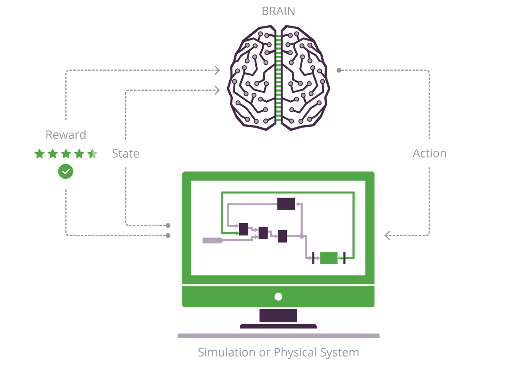
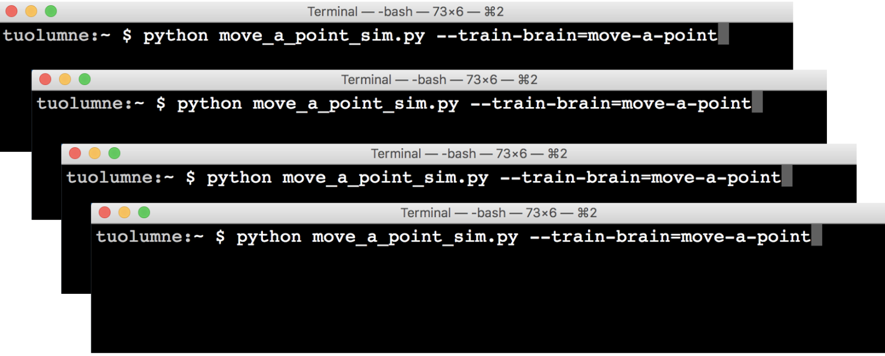

# Simulator Overview

> 

This reference gives you the information you’ll need to train a BRAIN on The Bonsai Platform with simulators. It covers best practices such as running simulations in parallel, general guidelines like how to configure web proxies with the CLI, and what simulators are currently supported.

Currently, The Bonsai Platform depends on simulators as a source of training data for applied deep reinforcement learning (DRL). For more background on applied DRL with simulations read our blog post on [simulations as a training environment][6].

The Bonsai Platform includes client libraries for Python & C++, two common languages used in systems modeling. We also have samples showing how to connect to OpenAI Gym Environments, Simulink models, and EnergyPlus models. To learn more about connecting your simulator, refer to our [Library Reference][4].

## What is a simulator?

A simulator is an imperative model of a process, transitioning from state to state as actions are applied. Robotics, industrial automation, supply chain logistics, and structural engineering are all domains which use simulators to model the behavior of complex systems.

Deep Reinforcement Learning can work with simulated models to train a BRAIN to perform tasks within the modeled system. Tasks can be as simple as "stand this pole upright" or as complex as "learn to walk." 

To be effective, a BRAIN needs to be trained using DRL against a simulated model. The Bonsai SDK allows the DRL system to control your simulator during the training process. Any simulator which has an initial state, and can be incremented through time, can be connected to the Bonsai training system.

## Currently Integrated Simulators

The Bonsai Platform currently supports an API and two client libraries written in Python or C++. The platform also includes connectors built ontop of these libraries. Currently available connectors:

* OpenAI Gym Environments (bonsai-gym)
* Simulink Universal Coordinator
    - Coder
    - Interactive
* EnergyPlus (via BCVTB)

A list of examples using these can be found on the [Examples][7] page.

# Running a Simulator from the CLI

> Simulator config help text

```
$ python <simulator_file>.py --help
usage: <simulator_file>.py [-h] [--accesskey ACCESSKEY] [--username USERNAME]
                      [--url URL] [--proxy PROXY] [--brain BRAIN]
                      [--predict [PREDICT]] [--verbose VERBOSE]
                      [--performance PERFORMANCE]

optional arguments:
  -h, --help            show this help message and exit
  --accesskey ACCESSKEY
                        The access key to use when connecting to the BRAIN
                        server. If specified, it will be used instead of any
                        access key information stored in a bonsai config file.
  --username USERNAME   Bonsai username.
  --url URL             Bonsai server URL. The URL should be of the form
                        "https://api.bons.ai"
  --proxy PROXY         Proxy server address and port. Example: localhost:3128
  --brain BRAIN         The name of the BRAIN to connect to. Unless a version
                        is specified the BRAIN will connect for training.
  --predict [PREDICT]   If set, the BRAIN will connect for prediction with the
                        specified version. May be a positive integer number or
                        'latest' for the most recent version. For example:
                        --predict=latest or --predict=3
  --verbose VERBOSE     Enables logging. Alias for --log=all
  --performance PERFORMANCE
                        Enables time delta logging. Alias for --log=perf.all
```

Currently, all connectors use a Python program to bootstrap the simulation and connect it to the Bonsai AI Engine. To run any simulation, you call a Python program which is shown in the code panel.

During development, you will need to iterate quickly on your simulation, reward function, and lesson plans. You may also need to connect a debugger, or do additional logging to help you get your simulation ready to train.

During the course of normal operation, one should only need to specify the prediction/training mode on the command line. The rest of the options will be read from configuration files.

To speed up training, you can run multiple simulators in parallel. See [Running Simulations in Parallel][5] below.

## Proxy Support

> Example Python Proxy

```python
my_config.proxy == 'myproxy:5000'
```

> Example CLI Proxy Usage

```shell
$ python <simulator_file>.py --proxy=localhost:3128
```

To connect a simulator from behind a corporate proxy, command line tools like the Bonsai SDK need to know where to send traffic. For the Bonsai SDK, this is done by providing the proxy server address and port to the simulator config when running a simulator. There are multiple ways that you can do this such as through the CLI or in the simulator code itself.

## Prediction

```python
# Default version is latest
python <simulator_file>.py --predict

# OR
Python <simulator_file>.py --predict=1
```

After your BRAIN is finished training it can be used to "predict" or perform in the simulation. How well it does depends on how long you let it train! Using your BRAIN involves running your simulator file as you did when training, but now in prediction mode with `--predict`. The default is `--predict=latest` which will use the version of the latest training session that you just ran. You can use a different version of your BRAIN if you have trained it multiple times by replacing `latest` with the version number.

# Cloud Hosted Simulators

The Bonsai Platform can run several simulators for you in our cloud environment. This means you can start and stop training all from the web interface, without needing to download and install the Bonsai CLI or SDK. You will still need to run the simulator locally using the CLI to obtain predictions, however.

Cloud-hosted simulators are useful for prolonged training to avoid your computer becoming idle and stopping training. At this time, you can only run one simulator cloud-hosted, and cannot take advantage of training speed increases from [running simulators in parallel][5].

Current list of supported libraries for cloud-hosted training:

* OpenAI Gym environment: [`openai.gym`][1]
* Bonsai Python `bonsai-ai` library: [`bonsai.ai`][10]
* EnergyPlus Simulator: [`bonsai.energyplus`][3]
* Legacy `bonsai-python` library: [`bonsai.python`][2]

In order to set your BRAIN to use one of these cloud-hosted simulators, you’ll either need to start with a starter project and modify your BRAIN’s [project (`.bproj`) file][8] or use one of the Bonsai demo projects.

# Running Simulations in Parallel

> 

Training can take a long time. Depending on the complexity of the problem and the way your lesson plans are written, training can take several hours to several days. Fortunately, training can happen in parallel. Each new simulator you connect to a running training session will increase the episode per second training rate which will help the BRAIN find better solutions faster. How much you can increase training depends on the speed of your simulation: if your simulation takes 1s per iteration, it will be beneficial to run dozens in parallel.

Running simulations in parallel is currently only supported either when running your simulator locally via the Bonsai CLI, or in your own private cloud on AWS or Azure. Simply connect multiple instances of your simulation to the same BRAIN to take advantage of this feature. Eventually, the system will no longer handle any more messages per second and you will see a plateau of improvement in training.


[1]: https://quay.io/repository/bonsai/gym
[2]: https://quay.io/repository/bonsai/python
[3]: https://quay.io/repository/bonsai/energyplus
[4]: ./library-reference.html
[5]: #running-simulators-in-parallel
[6]: https://bons.ai/blog/simulators-deep-reinforcement-learning
[7]: ../examples.html
[8]: ./cli-reference.html#bproj-file
[9]: ./library-reference.html#proxy
[10]: https://quay.io/repository/bonsai/bonsai-ai
